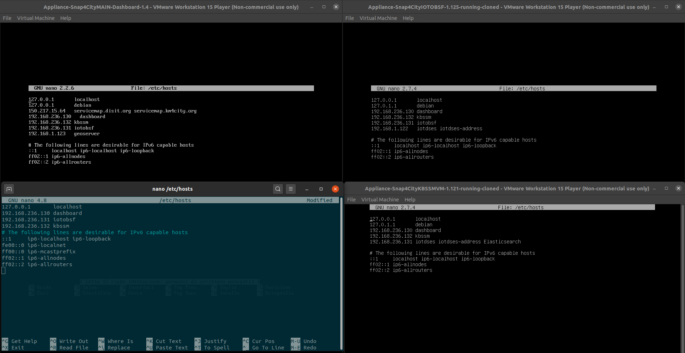
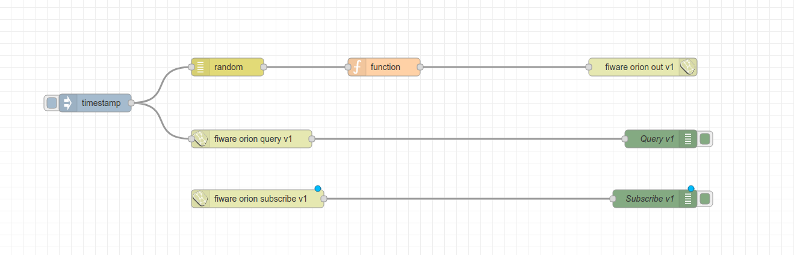
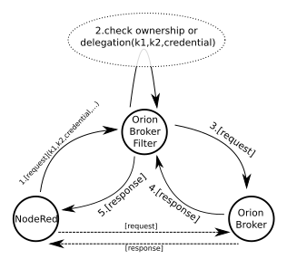

# Big data architectures: Sviluppo OrionFiware API v2 in nodi NodeRed e integrazione in Snap4City

## 1. Installazione ambiente di test

Ambiente utilizzato _Ubuntu 20.04_ in una macchina con SSD, i7-7700HQ e 16GB Ram.

_I link alle VM di Snap4City sono stati recuperati da questo [link](https://www.snap4city.org/drupal/node/471), in cui troverete informazioni e guide più dettagliate; le versioni utilizzate sono aggiornate al 12-09-2020._

1. Installare **VMware** ( o altra );
2. Scaricare ed estrarre:

   - [Snap4CityMAIN v1.5](https://www.snap4city.org/download/video/vm/Appliance-Snap4CityMAIN-Dashboard-1.5.rar);
   - [Snap4CityIOTOBSF v1.2](https://www.snap4city.org/download/video/vm/Appliance-Snap4CityIOTOBSF-1.2.rar);
   - [Snap4CityKBSSMVM v1.2](https://www.snap4city.org/download/video/vm/Appliance-Snap4CityKBSSMVM-1.2.rar);

3. Aprire VMware e importare le VM;

4. Per ognuna delle VMs controllare che il _Network Adapter_ sia impostato su **NAT**;
5. Cominciando da _Snap4CityMAIN_, avviare la VM, accedete con le [credenziali](https://www.snap4city.org/drupal/node/487):

   _username_: debian

   _password_: debian

   verificare l'IP assegnato alla macchina con:

   ```
   sudo ifconfig
   ```

   cambiare l'IP delle VMs in:

   ```
   sudo nano /etc/hosts
   ```

6. Settare l'IP delle VMs anche nell'host in:
   ```
   sudo nano /etc/hosts
   ```
   Alla all'interno di questo avrete tre righe simili:
   ```
   192.168.236.130 dashboard
   192.168.236.131 iotobsf
   192.168.236.132 kbssm
   ```



L'ambiente di test è pronto.
Verificate dal vostro browser su:

- http://dashboard:8080/
- http://iotobsf:8080/
- http://kbssm:8080/
---
## 2. NodeRed e FiwareOrion

### 2.1 Primi passi

Bisogna prima di tutto capire il funzionamento e il fine di **[NodeRed](https://nodered.org/docs/)** e **[FiwareOrion](https://fiware-orion.readthedocs.io/en/1.15.1/)**, le documentazioni sono ben fatte e ne danno un'idea abbastanza chiara.
Per avere un primo esempio del funzionamento di NodeRed è possibile guardare il tutorial di [NodeRed Hello World](https://www.youtube.com/watch?v=tvUvL7RErwQ&feature=youtu.be&t=2090).

I blocchetti (nodi) NodeRed sono dei wrapper di specifiche funzioni, possiamo dividerle in 3 macro categorie:

- Blocchetti che hanno un input che viene elaborato all'interno di questo e forniscono un output da poter riutilizzare (_FiwareOrion APIv2: Subscribe_).
- Blocchetti che ricevono un input da un blocchetto a questo collegato, lo elaborano secondo la funzione specificata e restituiscono un output da poter riutilizzare (_FiwareOrion APIv2: Query_).
- Blocchetti che ricevono un input da un blocco a questo collegato e elaborano un output (_FiwareOrion APIv2: Output_).

I nodi sono collegati tra loro con collegamenti uno-a-uno e uno-a-molti, con questi vengono implementate le applicazioni IOT di interesse.

### 2.2 Esempio IOT App con blocchetti FiwareOrion API v1

Per cominciare ad avere familiarità con Orion e NodeRed facciamo un esempio.

1. Dalla [Dashboard](http://dashboard/dashboardSmartCity) nell'IOT Directory creiamo un _IOT Device Model_ e un _IOT Device_ con cui andremo a lavorare.

   N.B.: la consistenza dei device e dei modelli tre la VM MAIN e la VM IOTOBSF viene mantenuta solo se al momento della creazione (attraverso la Dashboard) le due sono attive.

   - Operazioni effettuate tramite API direttamente sull'IOTOBSF non vengono rilevate dalla MAIN.
   - Capita che il container _orion-docker_orion_1_ va in crash, tramite il comando:
     ```
     docker container ls
     ```
     è possibile vedere che va in _Restarting_, ad ora l unica soluzione è di eliminare il container e ricrearlo, anche in questo caso bisogno ricreare dalla Dashboard sia modello che device in quanto il precedente non sarà presente nel broker.

2. Apriamo **IOT Application** ovvero NodeRed.
3. Importiamo il _flow_ di esempio delle API v1 in cui vanno cambiati i parametri del device: Id, Type, K1, K2.
   

4. Testiamo il funzionamento.

### 2.3 Ambiente di sviluppo NodeRed locale

Prima di tutto andiamo a impostare l'ambiente di sviluppo locale con cui poter lavorare sui nodi.

1. Installiamo **NodeRed** in locale.
2. Forkiamo la repository [node-red-contrib-snap4city-user](https://github.com/disit/node-red-contrib-snap4city-user) e creiamo un branch con il nome del lavoro da svolgere, in questo caso [node-red-fiware-orion-API-v2-nodes](https://github.com/palace22/node-red-contrib-snap4city-user/tree/node-red-fiware-orion-API-v2-nodes).
3. Installiamo i nodi su NodeRed locale:
   ```
   cd .node-red/
   npm i $PATH/node-red-contrib-snap4city-user
   ```
4. Definiamo all'interno del file *./node-red/settings.js* 
    ```js
    var keycloak_base_uri = 'http://dashboard:8088/auth/admin/master'
    var keycloak_clientid = 'nodered-iotedge'
    var keycloak_clientsecret = 'ec4f3896-8fee-4f37-8703-eee13e7bd609'
    var iotdirectory_uri = 'https://www.snap4city.org/  iotdirectorytest/'
    var ownership_url = 'http://dashboard/ownership-api/'
    ```
    e aggiungiamo in *module.exports* dello stesso:
    ```js
    module.exports = {
        keycloakBaseUri: keycloak_base_uri,
        keycloakClientid: keycloak_clientid,
        keycloakClientsecret: keycloak_clientsecret,
        iotDirectoryUrl: iotdirectory_uri,
        ownershipUrl: ownership_url,
        ...
    }
    ```
    e infine creiamo un client "*nodered-iotedge*" in http://dashboard:8088/auth/ accedendo con credenziali: *username: admin password: admin*.
    Come suggerito nell'eleborato *[Sviluppi Snap4City](https://github.com/palace22/BigDataArchitecturesProject/blob/master/Elaborati/Sviluppi_Snap4City.pdf)* di Andrea Spitaleri.
5. Da terminale avviamo NodeRed:
   ```
   node-red
   ```

### 2.4 Implementazione Fiware Orion API v2

Alla pagina della documentazione di FiwareOrion è possibile trovare la [sezione](https://fiware-orion.readthedocs.io/en/2.4.2/user/forbidden_characters/index.html#custom-payload-special-treatment) dedicata alle API e come queste devono essere usate. A differenza della prima versione queste sono più chiare nell'utilizzo, sfruttando i metodi HTTP (POST, GET, PATCH, ...) nel migliore dei modi, rendendo la sintassi delle richieste più chiara e leggera; il salvataggio e l'aggionamento di entità all'interno del broker rimane comunque retrocompatibile con la versione 1.

Il procedimento che ho seguito è il seguente: una volta duplicati i file .js e .html dei nodi Orion V1 (_orion.js_ e _otion.html_), ho rinominato i file e i nodi per averli visibili in NodeRed.

I file in cui vengono implemetati i blocchi NodeRed vengono definiti in _package.json_:

```
    "node-red": {
        "nodes": {
            ...
            "fiware-orion": "orion.js",
            "fiware-orion-api-v2": "orionAPIv2.js",
            ...
        }
    }
```
Mentre i nomi dei blocchi vengono definiti nel file .js e .html al momento della registrazione:
```js
RED.nodes.registerType("Fiware-Orion API v2: Subscribe", ...
```
e nel .html in altre svariate parti per poter mostrare il nome nell'interfaccia grafica.

Fatto ciò è possibile aprire NodeRed locale ( di default a *[localhost:1880](localhost:1880)* ) e verificare che i nodi siano presenti.

Da notare che le richieste verso l'Orion broker vengono prima filtrate per assicurare l'appartenenza del device o del singolo sensore a chi l'effettua. In Snap4city questo compito è svolto dal *OrionContextBroker* come mostrato nell'immagine. Dal momento in cui al momenti i path controllati sono quelli con prefisso */v1/* bypassiamo l'*OrionContextBroker* facendo le richieste direttamente al broker come mostrato nella figura dalle frecce tratteggiate.



 Questo si traduce nell'impostare nel nodo Service il path del broker della VM iotobsf: [iotobsf:1026](iotobsf:1026). e utilizzare a livello di codice il protocollo http piuttosto che https. 

Ho iniziato facendo alcune prove seguendo la documentazione delle API e utilizzando **[Postman](https://www.postman.com/)**.
#### **Subscribe**
Il primo nodo implementato è stato quello del **Subscribe**, procedendo cambiando il path e il payload della richiesta, adattando poi la risposta di Orion a NodeRed: a differenza delle API v1 nelle v2 l'ID della subscription viene restituito nell'*header* della risposta al parametro *Location* e non nel body.

#### **Query**
Il nodo **Query** da una richiesta POST diventa una di tipo GET, come ci si potrebbe aspettare, dunque sono state modificate le *options* della richiesta costruendo la query con parametri da aggiungere alla URL piuttosto che creare il body:
```
GET iotobsf:1026/v2/entities/{deviceName}?attrs={deviceAttribute}
```

#### **Update**
Riguardo l'Update degli attributi il metodo cambia da POST a PATCH cambiando anche il body. Un cambiamento importante è dato dalla risposta di questo metodo, mentre con le API v1 veniva restituito il body con il device aggiornato con le API v2 la risposta non ha body ma solo uno status code *204 No Content*. La mancanza del body rende il nodo che prende un input e restituisce un output inutile al suo scopo, è stato comunque implementato con il nome: *Fiware-Orion API v2: Test* mentre resta invariato l'utilizzo di *Fiware-Orion API v2: Update*.


### 2.5 Refactoring, pulizia codice e *SubscriptionStore*
Durante quest'implementazione ho notato del codice duplicato e parti di codice che poteva essere rifattorizzato. All'interno della cartella *utils* si trovano:
* *httpRequestOption.js*: classe i cui metodi generano le *options* delle richieste HTTP dei vari nodi (Query, Subscribe, ...).
* *nodeStatus.js*: classe in cui sono implementati i metodi che consentono di avere un feedback grafico su NodeRed.
* *subscriptionStore.js*: classe la cui responsabilità è di salvare coppie di: *[ID nodo: ID subscription]* in un file json così che una volta chiuso NodeRed alla sua riapertura si possa recuperare.
---
## 3. OrionBrokerFilter
Implementati i nodi delle API v2 bisogna integrarli seguendo la logica di Snap4City rigurando l'autenticazione dell'utente e dei device/sensori. Riprendendo l'immagine delle richieste:


### 3.1 Preparazione ambiente 

Dunque installiamo in locale l'OrionBrokerFilter e configuriamolo per il nostro ambiente di sviluppo.
Il progetto si trova all'interno della cartella **OrionBrokerFilter** della repo di [Snap4City](https://github.com/disit/snap4city).

L'ambiente di sviluppo è cosi configurato: JDK *java-8-openjdk*, come IDE ho utilizzato Eclipse, per avviare il progetto ho utilizzato il plugin di [Tomcat](https://marketplace.eclipse.org/content/eclipse-tomcat-plugin).

Apriamo Eclipse e importiamo il progetto come *progetto maven esistente*, fatto ciò dalla cartella del progetto lanciamo:
```
mvn clean install -DskipTests
```
Questo installerà le dipendenze necessarie definite nel *pom.xml* e genererà i target.

Impostiamo le configurazioni necessarie, in *src/main/resources/* troviamo dei file .properties in cui sono dichiarati dei parametri utilizzati da Spring all'interno dell'applicazione, con l'aiuto di Angelo li ho definiti in questo modo nel file *application-local.properties*    `:
```bash
logging.config=classpath:/log4j2-spring-local.xml

spring.openidconnect.clientid=orionbrokerfilter
spring.openidconnect.username=userrootadmin
spring.openidconnect.password=Sl9.wrE@k

#keyclock di test
spring.openidconnect.token_endpoint=http://dashboard:8088/auth/realms/master/protocol/openid-connect/token

spring.ownership_endpoint=http://dashboard/ownership-api/v1/list
spring.delegation_endpoint=http://dashboard:8080/datamanager/api/v1/apps
spring.orionbroker_endpoint=http://iotobsf:1026

spring.elapsingcache.minutes=3

#cors.origins.accepted=http://localhost

spring.prefixelementID=Organization:iotobsf

connection.timeout=10000
connection.max=20
```

Durante lo sviluppo di questa integrazione è stato riscontrato un problema dato da queste configurazioni in quanto l'ownership dei device non veniva trovata, questo è stato risolto andando a controllare all'interno del MySQL db della VM MAIN nello specifico nella tabella *ownership* del *profiledb*, per accedervi ho utilizzato [Beekeeper Studio](https://www.beekeeperstudio.io/) accedendo con:
```
host: dashboard
port: 3306
user: root
password: password
default database: profiledb
```

Il problema è stato risolto cambiando il parametro 
*spring.prefixelementID* da *DISIT:iotobsf* a *Organization:iotobsf* come mostrato dal campo *elementId* del db.

Assicuriamoci inoltre con sia presente un client *orionbrokerfilter* in http://dashboard:8088/auth/ e in caso negativo creiamolo.

Prima di avviare il server bisogna settare il file *.properties* e il path del log da utilizzare in *Preferences>Tomcat>JVM Settings* nel mio caso aggiungo come parametri:
```
-Dspring.profiles.active=local -DlogFileFolder=/home/user/Documents/log
```
Mentre in *Preferences>Tomcat>Tomcat Manager App* settiamo le credenziali per accedere all'application manager.
Avviato il server accediamo all'application manarer di default a http://localhost:8080/manager con le credenziali settate, scegliamo il file WAR ovvero *orionbrokerfilter-0.0.1.war* nella cartella target e "deployamo".

### 3.2 Test funzionamento su API v1
Per essere certi che tutto sia stato configurato correttamente testiamo il funzionamento dell'OrionBrokerFilter con le API v1 dunque da NodeRed aggiungiamo un nuovo service:
```
"name": "orionbrokerfilter",
"url": "localhost/orionbrokerfilter-0.0.1",
"port": "8080"
```
deployamo il flow e verifichiamo il funzionamento.

### 3.3 Implementazione filter per API v2
I file dell'OrionBrokerFilter che bisogna modificare sono tre:
1. Innanzitutto è stato aggiunto il prefisso */v2/* al matcher del filtro nel file *MultiHttpSecurityConfig*.
2. In *OrionController* sono stati implementati i metodi relativi agli endpoint delle richieste Orion, prendiamo come esempio la richiesta di update: 
    ```java
	@RequestMapping(value = "/v2/entities/{deviceId}/attrs", method = RequestMethod.PATCH, consumes = { "application/json" })
	@ResponseBody
	public ResponseEntity<String> updateV2(@PathVariable("deviceId") String deviceId, @RequestBody String payload, @RequestHeader HttpHeaders headers) {

		UriComponents uriComponents = UriComponentsBuilder.fromHttpUrl(orionbroker_endpoint + "/v2/entities/"+deviceId+"/attrs")
				.build();

		return proxyPatchRequest(uriComponents, payload, headers);
	}
    ```

    Inseme agli endpoint sono stati implementati i proxy relativi ai metodi: GET, PATCH, DELETE che con l'API v1 non vevivano utilizzati, continuando l'esempio:

    ```JAVA
	private ResponseEntity<String> proxyPatchRequest(UriComponents uriComponents, String payload, HttpHeaders headers) {
		logger.info("Proxying request to {} on {}", uriComponents.toString(), payload);

		HttpEntity<String> entity = new HttpEntity<>(payload, headers);

		try {
			ResponseEntity<String> response = restTemplate.exchange(uriComponents.toUri(), HttpMethod.PATCH, entity, String.class);
			logger.debug(response);
			
		} catch (HttpClientErrorException e) {
			logger.error("Trouble in proxyPatchRequest: ", e);
			return new ResponseEntity<String>(e.getMessage(), e.getStatusCode());
		} catch (Exception e) {
			logger.error("BIG Trouble in proxyPatchRequest", e);
			return new ResponseEntity<String>(e.getMessage(), HttpStatus.INTERNAL_SERVER_ERROR);
		}
		return new ResponseEntity<String>(HttpStatus.NO_CONTENT);
	}
    ```

    Da qui ho provato il funzionamento delle nuove funzioni, controllando se venissero chiamate e se ci fossero errori e questo mi ha portato anche grazie al supporto di Angelo alla modifice del terzo file.
3.  L'ultima modifica è stata effettuata nel *AccessTokenAuthenticationFilter* e riguarda il nome dei sensori del device della richiesta, una volta estratto il nome del sensore viene verificato che chi effettua la richiesta abbia l'autorizzazione, il sensore sia suo o gli è stato delegato, in caso negativo questa non può andare a buon fine. Dunque ho implementato il metodo *getSensorNameAPIv2(...)* in modo da restituire il nome del sensore in base alla richiesta effettuata (GET, POST, etc.) e dunque permettere il controllo dell'autorizzazione.

Sono stati condotti altri test per verificare il funzionamento del tutto ed infine è stata creata una pull request per quanto riguarda il codice dei blocchetti ed è stato passato il link della repo dell'OrionFilter a Angelo che ha proceduto a vefiricare il funzionamento. 

---
## Bug conosciuti

1. La VM MAIN e la IOTOBSF non sono collegate. I dispositivi installati in una possono non essere visibili dall'altra.
2. Le sottoscrizioni non vengono salvate, al momento della chiusura di NodeRed le sottoscrizioni restano, l'unsubribe non puo essere fatto non conoscendo l'ID, la subscription viene eliminata all'expire. **RISOLTO**
3.  Nella VM IOTOBSF, il container di orion ogni tanto (non sono stato in grado di riprodurlo) va in restarting.
**POSSIBILE SOLUZIONE**: entrare nella cartella in cui è presente docker-compose:
    ```
    sudo docker-compose down
    sudo docker-compose up -d
    ```
    **Soluzione drastica** rimuove tutto e reinstalla i     container, verranno eliminati i device e i dati inseriti    (BUG 1.):
    ```
    sudo docker-compose down -v --rmi all --remove-orphans
    sudo docker-compose up -d
    ```
4. La VM MAIN ogni tanto (non sono stato in grado di riprodurlo) da errori di kernel, unica soluzione reinstallare la VM ( BUG punto 1, i dispositivi precedentemente installati e presenti in IOTOBSF non sono piu visibili).

## Possibili sviluppi
1. **node-red-contrib-snap4city-user**: Continuazione refactoring codice di *OrionAPIv2* soprattutto riguardo le richieste http. Inoltre sarebbe opportuno dividere il file creandone uno per ogni nodo e strutturare meglio il file *snap4city-utility*.
2. **OrionBrokerFilter**: Al momento, per ogni richiesta (es. Update) viene controllato solamente un sensore (il primo), le richieste dunque vengono eseguite pur non controllando l'ownership o la delegation degli altri o il alternativa consentire l'inserimento di un solo attributo.
3. Recupero dati da IOTOBSF e inserirli nella VM MAIN e viceversa check di device nella VM MAIN in IOTOBSF.
4. Creazione su Github di un progetto **Snap4City** in cui inserire una repo per ogni cartella di [snap4city](https://github.com/disit/snap4city).
